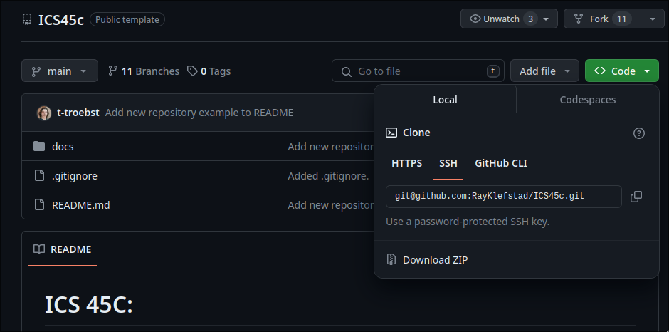

# ICS 45C

Welcome to the ICS 45C GitHub landing page! This GitHub project will contain all of the project
setup material you need for this class. This `main` branch will introduce the tools we will be
using in this class in brief detail. To access instructions for a specific homework, use the
branch drop down menu above to select the homework you wish to work on!


This class will `REQUIRE` the use of a [GitHub](#github) account, so be sure to set one up before
following the instructions below. It does not need to be linked to your UCI email.

## Tools

The following are a list of tools that will be used in this course. All of these tools have been
set up for use on [OpenLab](REPLACEME). Remember that we `WILL NOT` be able to support issues 
encountered if you use your personal setup, only the setup on `OpenLab`.

- git
- gcc
- make
- cmake
- valgrind
- gtest

## GitHub

GitHub is an online storage service for the tool `git`. `git` is used for saving changes to your
code and allows multiple people to make changes to the same code base and keep track of all the
different changes made at once. It also allows you to make multiple versions (or branches) so that
you can try out different approaches or changes without breaking what you were working on before.

On `OpenLab`, `git` will be pre-installed, so we will be setting up your basic profile and adding
`ssh-keys` to your account! To do this, you will need to access `OpenLab` via `ssh` or `putty` (depending
on the system you are using). This will give you access to `OpenLab`'s terminal, where we can
type commands to `git`. In this terminal, you will be adding your `username` and `email` by typing
the following (remember that items shown as `<Example>` should be replaced with YOUR information):

```bash
git config --global user.name "<YourNameHere>"    # Example: "Ray Klefstad"
git config --global user.email "<YourEmailHere>"  # Example: "klefstad@uci.edu"
```

We will also set up an `ssh` key because `GitHub` is moving away from allowing the usage of `https`
links. Please first take a look at [this page](https://docs.github.com/en/authentication/connecting-to-github-with-ssh/generating-a-new-ssh-key-and-adding-it-to-the-ssh-agent#generating-a-new-ssh-key)
which explains how to make an `ssh` key and then either follow the instructions there (NOTE: At the
top of the page, it will have three tabs for operating systems. OpenLab is a `Linux` machine, so make
sure that you select `Linux` and follow those instructions.) After you create your key, you will need to add
it to `GitHub`, by following 
[these instructions](https://docs.github.com/en/authentication/connecting-to-github-with-ssh/adding-a-new-ssh-key-to-your-github-account).

Once you have set up your `username`, `email`, and `ssh key`, you will need to
[clone](https://docs.github.com/en/repositories/creating-and-managing-repositories/cloning-a-repository)
this repository. On OpenLab, you can clone a repository by using `git clone` and copy-pasting the URL
you got from the green `Code` button above. Example below:



And then in the terminal, type:

```bash
git clone <YourLinkHere>
```

This will add the folder `ICS45c` to your current working directory, which you can see by
typing the `ls` command. You can now work in this folder and make changes locally, however you will
not be able to submit changes yet as you also need your own private copy of the repository on GitHub.

To do this, click on the + in the top right of the page, and select `New repository` as shown below:


Give your repository a name such as `ICS45c` and **make sure you set the visibility to private**. Once created,
you will set this repository up as a second `remote` so you can `push` your changes to it. To do this,
start by copying the SSH clone link of your private repository from the green `Code` button just as you did
for this repository. Now go back to openlab inside the folder `ICS45c` and run this command with the
copy-pasted link:

```bash
git remote add my_repo <YourLinkHere>
```

Your repository should now be set up correctly. To verify that it works, you can use the command:

```bash
git push my_repo
```

This will push the current content of your `ICS45c` folder including the text you are reading right now
to your private GitHub repository. If this finishes with no errors and your private repository is no longer
empty, then everything works and you can move on to `Homework 0.2`!

## CMake

`CMake` is an industry standard for building C/C++ projects. `CMake` in this class will consist of two
files which will be provided each homework: `CMakePresets.json` and `CMakeLists.txt`. `CMakePresets.json`
describes to `CMake` the arguments, flags, and preferences that you want the compiler to use when building
your project, as well as telling `CMake` where to put the files that it builds (which in this class will
be the `build/` folder). `CMakeLists.txt` describes the `.cpp` and `.hpp` files you intend to compile,
where to find them, and how to package them into an executable `target`.

Learning about `CMake` is likely to be useful to you if you ever work with C/C++ code bases. For this class,
we will provide simple `CMakeLists.txt` files with annotation to explain what each part is doing, but you will
not be required to change it in any way. If you are interested in learning more about `CMake`, you can find
more information at the official [CMake tutorial](https://cmake.org/cmake/help/latest/guide/tutorial/index.html).

## GTest

GTest is an incredibly popular testing platform for `.cpp`. While there are other testing platforms
this one is fairly popular in large code bases and also the one already available on OpenLab. Testing
your programs before submitting them is HIGHLY recommended (and will be required in several assignments)
to ensure your code behaves as you expect it to. We will cover the basics of using `GTest` and adding
your own tests in the required homeworks, but for more detailed information take a look at their
[primer documentation](https://google.github.io/googletest/primer.html).

